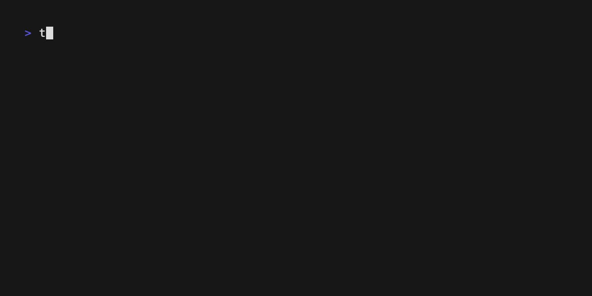

<p align="center">
  
</p>

<h1 align="center">Developer Documentation</h1>

Welcome to the Tusk CLI development guide. This document outlines the internal mechanics, contribution standards, and operational workflows.

## 🛠 Internal Architecture

Tusk is built on a modular command-based architecture using **Commander.js**.

- **`bin/tusk.js`**: Entry point and command registration.
- **`src/commands/`**: Domain-specific command implementations.
- **`src/utils/`**: Shared logic for shell execution, sanitization, and file safety.

## 📽 Command Demos

### 1. Data Seeding
Tusk supports multiple seeding strategies to ensure your local DB matches your development needs.



### 2. Deployment Planning
Compare your local drift against remote sources using Prisma.


### 3. Source Mocking
Create a hermetic testing environment by generating a mock remote database.


## 🧪 Testing & Coding Standards

### Relative Path Mandate
To ensure that generated documentation (GIFs/PNGs) is professional and agnostic of the developer's local environment, **ALL** CLI logging that includes file paths **MUST** use `path.relative(process.cwd(), filePath)`.

### Unit Tests
We use the native `node:test` runner. All utilities MUST have 100% coverage.

### Running Tests
```bash
npm test
```

### Smoke Test
The smoke test verifies every CLI command in `--dry-run` mode.
```bash
npm run smoke
```

## 🔒 The @lock Protocol

To prevent the CLI from overwriting manual changes, add `/@lock/` to the first two lines of any generated file. The `safeWrite` utility will respect this unless the `--force` flag is used.

## 🐳 Docker Operations & Connectivity

The local environment is defined in `infrastructure/build-context/Dockerfile` and orchestrated via `docker-compose.yml`.

### Lifecycle Commands
- **Start:** `docker-compose up -d`
- **Rebuild:** `docker-compose up -d --build` (Required if `requirements.txt` or `tusk.conf` changes)
- **Stop:** `docker-compose stop` (Pause containers)
- **Cleanup:** `docker-compose down -v` (Removes containers and volumes)
- **Logs:** `docker-compose logs -f` (Tail logs to debug initialization)

### Connecting to the Database

#### 1. Shell Access (Internal)
Enter the running container to run manual SQL or inspect the filesystem:
```bash
docker exec -it tusk-local-db /bin/bash
```

#### 2. Command Line (psql)
Access specific databases synchronized by Tusk:
```bash
# Replace 'local_db' with your local_target_name from tusk.yaml
psql "host=127.0.0.1 user=postgres dbname=local_db"
```

> **Tip:** If `psql` prompts for a password, ensure your `~/.pgpass` has a matching entry. If you use `host=127.0.0.1` in your command, the entry in `.pgpass` must also use `127.0.0.1` (not `localhost`).
> **Format:** `127.0.0.1:5432:*:postgres:yourpassword`

#### 3. External GUI Tools (PGAdmin / DBeaver / Datagrip)
- **Host:** `127.0.0.1`
- **Port:** `5432`
- **Maintenance DB:** `postgres`
- **Username:** `postgres`
- **Password:** `postgres` (Default, but also might not be set for local)
- **SSL Mode:** `disable`

### Troubleshooting Initialization
If your tables are missing after boot, check the **Smart Runner** logs:
```bash
docker-compose logs db | grep "Applying"
```
Ensure that `infrastructure/volume-mounts/ddl/` contains the expected `.sql` files with the correct prefix (`200__`, `400__`, etc.).

## 🐘 PostgreSQL Tooling & Credentials

### 🔑 Credentials Management (.pgpass)
The PostgreSQL password file (`~/.pgpass` on Unix/macOS) allows you to connect to databases without entering a password every time.

**Format:** `hostname:port:database:username:password`

#### Critical Requirements:
1.  **Permissions:** The file **must** have strict permissions or it will be ignored.
    ```bash
    chmod 0600 ~/.pgpass
    ```
2.  **Host Matching:** If you connect using `127.0.0.1`, the entry must start with `127.0.0.1`. If you use `localhost`, it must start with `localhost`.
    - **Recommended for Tusk:** `127.0.0.1:5432:*:postgres:postgres`

#### Examples:
- **Default Tusk Password:** `127.0.0.1:5432:*:postgres:postgres`
- **No Password:** `127.0.0.1:5432:*:postgres:`
- **Wildcard Database:** Use `*` for the database field to match all databases on that host.

---

### ⌨️ Useful `psql` Commands
When connected to a database, these meta-commands are invaluable:

| Command | Description |
| :--- | :--- |
| `\l` | List all databases |
| `\c dbname` | Connect to a different database |
| `\dt` | List all tables in the current schema |
| `\dt+` | List all tables with size and description |
| `\dn` | List all schemas |
| `\df` | List all functions |
| `\dv` | List all views |
| `\d tablename` | Describe a specific table (columns, types, indexes) |
| `\dx` | List installed extensions |
| `\q` | Quit psql |
| `\watch 5` | Re-run the previous query every 5 seconds |
| `\x` | Toggle expanded display (useful for wide tables) |

#### Run a query and exit:
```bash
psql -h 127.0.0.1 -U postgres -d local_db -c "SELECT count(*) FROM bookstore_ops.authors;"
```
