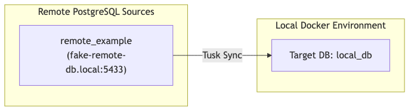
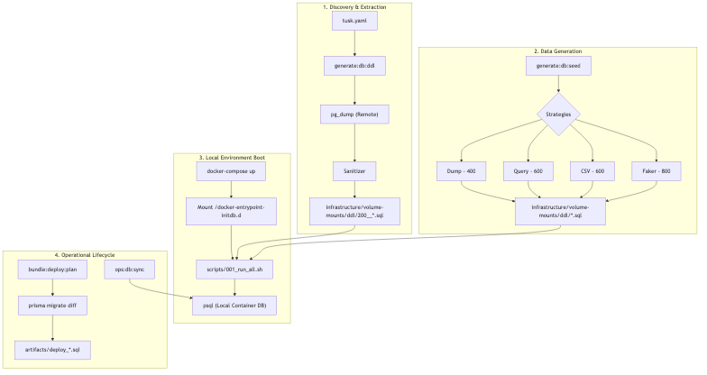
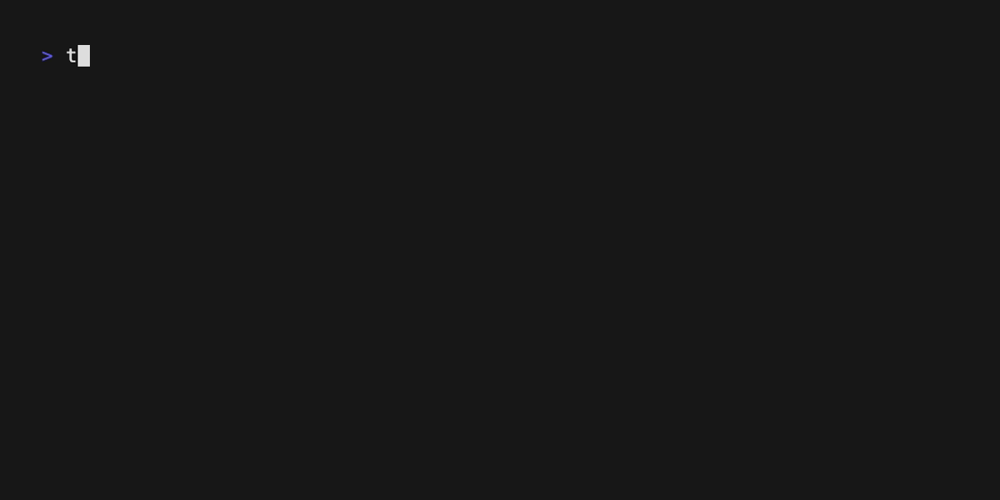

<p align="center">
  
  <br>
  <samp>Automate your local PostgreSQL development with precision.</samp>
  <br>
  <a href="hhttps://github.com/phillpafford/tusk-cli/releases"></a>
  <a href="hhttps://github.com/phillpafford/tusk-cli/actions"></a>
</p>

---

# Tusk CLI

Tusk CLI is a pragmatic tool designed for Senior DBREs and Backend Engineers to synchronize Schema (DDL) and seed data from remote PostgreSQL Databases into a local Dockerized environment.

---

## 🏗 Architecture

Tusk bridges the gap between complex remote cloud databases and your local development workflow.



## 🔄 Lifecycle Workflow

Understand how Tusk manages your data lifecycle from discovery to operations.



---

## 🚀 Quick Start

### 1. Check your environment
Ensure you have the required system tools (`psql`, `docker`, `node`).



```bash
tusk ops:env:check
```

### 2. Scaffold your config
Initialize your `tusk.yaml` and directory structure.

```bash
tusk init
```

### 3. Generate Local DDL
Extract sanitized schema from your remote sources.


```bash
tusk generate:db:ddl
```

---

## 📖 Documentation

- **[Configuration Reference](docs/CONFIG_REFERENCE.md):** Detailed guide for all `tusk.yaml` options.
- **[Developer Guide](DEVELOPER.md):** Internal architecture and contribution standards.
- **[Contributing](CONTRIBUTING.md):** Workflow for improving Tusk.

---

## 🔌 Local Connectivity

Once your Docker environment is running, you can connect to your local databases using the following settings:

- **Host:** `127.0.0.1` (Preferred over `localhost` to avoid IPv6 conflicts)
- **Port:** `5432`
- **User:** `postgres` (default)
- **Password:** `postgres` (or as defined in your environment)
- **SSL:** Disabled

### 💻 Command Line (via Docker)
```bash
docker exec -it tusk-local-db psql -U postgres -d local_db
```

### 💻 Command Line (Native psql)
```bash
psql -h 127.0.0.1 -U postgres -d local_db
```

### 🎨 GUI Tools (PGAdmin / DBeaver)
Create a new connection pointing to `127.0.0.1:5432` with the credentials above. Disable SSL requirements for local development.

---

## ✨ Key Features

- **AWS Sanitization:** Automatically comments out cloud-exclusive extensions (`aws_s3`, `rds_tools`, etc.).
- **Smart Seeding:** Supports `pg_dump`, Custom SQL, CSV, and high-fidelity Faker data.
- **Prisma Integration:** Uses Prisma Migrate Diff for schema comparison and deployment planning.
- **Source Mocking:** Generate "Mock Remotes" to test your sync pipeline locally.

## 🛠 Command Reference

### `generate` Namespace
| Command | Options | Description |
| :--- | :--- | :--- |
| `db:init` | `-f, --force` | Generates `000_init.sql` to create configured databases. |
| `db:ddl` | `-b, --database`, `-f, --force` | Extracts sanitized schema from remote sources. |
| `db:seed` | `-f, --force` | Populates data using Dump, Faker, CSV, or Query methods. |
| `db:reset` | `-f, --force` | Full reset: Resets config, cleans artifacts, and re-scaffolds demo. |
| `db:query` | `-f, --file`, `-v, --verbose`, `--force` | Executes a remote query and generates a local seed artifact. |
| `config:csv` | N/A | Generates an example CSV scaffold. |
| `config:faker` | N/A | Generates an example Faker YAML scaffold. |
| `config:query` | `-t, --table`, `-f, --force` | Generates a custom SQL query scaffold with metadata. |
| `config:db` | `-n, --name` | Appends a new database configuration template to `tusk.yaml`. |
| `config:reset` | `-f, --force` | Resets `tusk.yaml` to the default demo configuration. |
| `diagram:mmd` | `-f, --force` | Generates Mermaid source files. |
| `diagram:render` | `-f, --force` | Renders Mermaid files to PNG. |
| `demo:tape` | `-f, --force` | Generates VHS tape source files. |
| `demo:render` | `-f, --force` | Renders VHS tapes to GIFs. |
| `test:source` | `-c, --context` | Generates a mock remote database suite for testing. |

### `ops` Namespace
| Command | Options | Description |
| :--- | :--- | :--- |
| `env:check` | N/A | Verifies system health, port 5432, and .pgpass. |
| `env:test` | N/A | Execute a self-test by running all commands in dry-run mode. |
| `db:check` | N/A | Verifies connectivity and privileges for remote sources. |
| `db:sync` | N/A | Loads generated data artifacts into the local container. |
| `db:diff` | N/A | Wrapper for Prisma migrate diff (Schema comparison). |

### `bundle` Namespace
| Command | Options | Description |
| :--- | :--- | :--- |
| `prep:deploy` | `-s, --slug` | Generates a grouped deployment plan artifact for DBA review. |
| `prep:revert` | `-s, --slug` | Generates a grouped rollback artifact for DBA review. |
| `prep:verify` | `-s, --slug` | Generates a grouped verification artifact using DO blocks. |

### `cleanup` Namespace
| Command | Options | Description |
| :--- | :--- | :--- |
| `db:artifacts` | `-f, --force` | Removes all SQL artifacts and documentation assets. |
| `docs:all` | `-f, --force` | Removes all documentation assets (MMD, PNG, Tapes, GIFs). |
| `docs:diagram` | `-f, --force` | Removes only diagram assets (MMD, PNG). |
| `docs:demo` | `-f, --force` | Removes only demo assets (Tapes, GIFs). |
| `test:source` | `-f, --force` | Removes all generated mock source data. |

---

> **Global Note:** All commands (except `ops:env:check`) support the `-d, --dry-run` flag to simulate execution without modifying the filesystem or database.

## ✨ Key Features
